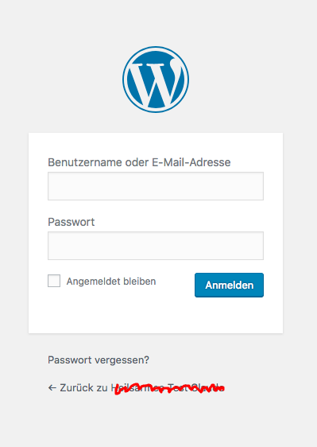
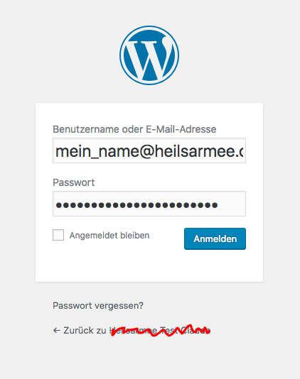

# Anmelden
Um Ihre Seite zu bearbeiten, müssen Sie sich als erstes als Administrator Ihrer Webseite anmelden. Dazu fügen Sie der URL Ihrer Seite `/admin` hinzu und besuchen sie diese Seite.

    Beispiel:
    beispiel.heilsarmee.ch wird zu beispiel.heilsarmee.ch/admin
    http://heilsarmee_communities.staging.stimul.io/beispiel/ wird zu http://heilsarmee_communities.staging.stimul.io/beispiel/admin

Damit sollten Sie nun das WordPress-Login erreichen:

Der Benutzername ist in den meisten Fällen Ihre @heilsarmee.ch-E-Mail-Adresse mit Unterstrichen ( _ ) zwischen Vor- und Nachname

    Beispiel:
    jane_doe@heilsarmee.ch

Nach einem Klick auf `Anmelden` erreichen Sie das WordPress-Interface, das sogenannte Backend Ihrer Webseite:

