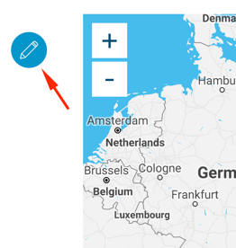

# Back- und Frontend

Um Ihre Webseite zu verwalten und zu bearbeiten, steht Ihnen ein Backend und ein Frontend zur Verfügung.
Das Einfügen von Inhalten, Zusammenstellen von Modulen und der grösste Teil Ihrer Arbeit wird im Frontend stattfinden. Im Backend können Sie z. B. Ihre Medien-Bibliothek verwalten, Spracheinstellungen ändern, Blogeinträge verwalten und Statistiken einsehen. 

# Das Backend
> TBD

# Das Frontend
## Zum Frontend gelangen
Nach dem Anmelden gelangen Sie immer als erstes zum Backend Ihrer Webseite (dem WordPress-Interface).

Damit Sie Ihre Webseite sehen und visuell bearbeiten können, müssen Sie auf das Frontend zugreifen.
Am oberen Rand des WordPress-Interfaces sehen Sie eine Liste Ihrer Webseiten (meisten eine einzige). Um zum Frontend zu gelangen, klicken Sie auf den Namen der entsprechenden Webseite neben dem Haus-Symbol. 

Hiermit sollten Sie das Frontend mit Bearbeitungsrechten Ihrer Webseite erreicht haben:

## Bearbeitung über das Frontend
Wenn Sie als Administrator Ihrer Webseite angemeldet sind und auf das Frontend Ihrer Webseite zugreifen, sehen Sie Ihre Webseite, wie sie auch ein Besucher sehen würde. Zusätzlich zum normalen Besucher haben Sie aber als Administrator einige Buttons, um die Webseite zu bearbeiten:

 - Mit "Seite bearbeiten" können Sie das Bearbeitungs-Menü der aktuellen Seite öffnen und darin Änderungen vornehmen.
 - Mit "Artikel erstellen" können Sie einen neuen Artikel auf dem zugehörigen Blog posten.
 - Mit "Seite erstellen" können Sie weitere Seiten erstellen. Dies sollte für die meisten Benutzer nicht nötig sein und wird nicht empfohlen. Bleiben Sie nach Möglichkeit bei einem One-Page Konzept.
 - Mit "Konfiguration" können Sie noch einige allgemeine Einstellungen zu Ihrer Webseite tätigen. Diese sollten Sie zu Beginn tätigen. Sie müssen danach nur in seltenen Fällen wieder geändert werden.

Zusätzlich erscheint bei jedem Modul auf Ihrer Webseite ein Bearbeitungs-Button, wenn Sie sich mit dem Cursor darüber befinden:

Dieser Button öffnet das Bearbeitungs-Menü dieses Moduls und Sie können so die entsprechenden Inhalte des Moduls ändern.
