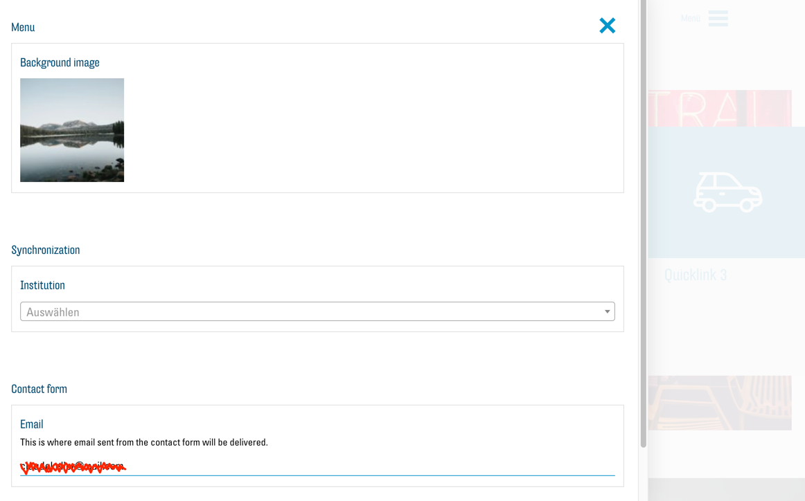
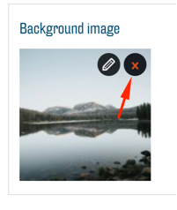
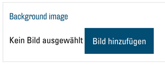
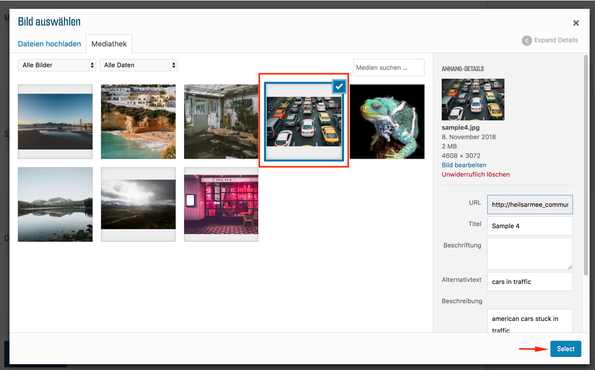
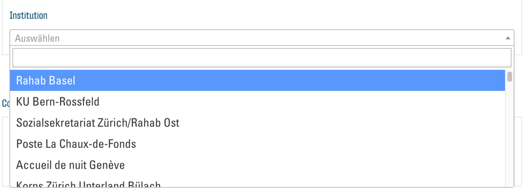
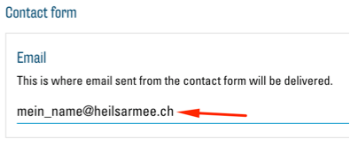
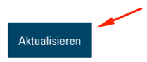
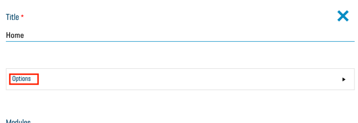

# Konfiguration
Zu Beginn wird empfohlen, alle Einstellungen im Konfigurations-Menü zu tätigen. Dies stellt sicher, dass alle Module wie erwartet funktionieren und für Ihre Webseite angepasst sind. Klicken Sie auf den Button "Konfiguration" (siehe [Bearbeitung über das Frontend](00.02-back-and-front.md#bearbeitung-uber-das-frontend)) oben auf Ihrer Webseite, um das Menü zu öffnen:

## Menü-Hintergrundbild
- Unter "Background image" können Sie das Bild ändern das im Menü der Seite erscheint. Hinweis: Dieses Bild wird nur benötigt, wenn Sie entweder mehr als eine Seite haben oder eine mehrsprachige Webseite erstellen. Damit Sie ein neues Bild wählen können muss zuerst das aktuelle entfernt werden. Klicken Sie dazu auf den X-Button, der erscheint, wenn Sie mit dem Cursor über dem aktuellen Bild sind:

Über den Button "Bild hinzufügen" können Sie nun ein neues Bild wählen:

 

Es öffnet sich das Mediathek-Fenster. Sie können das gewünschte Bild auswählen und mit einem Klick auf "Select" bestätigen:

 

Weitere Instruktionen zum Umgang mit der Mediathek finden Sie im entsprechenden Abschnitt.

##Institution
- Wählen Sie aus dem Dropdown-Menü unter Institution den Standort/die Institution. für den/die Ihre die Webseite ist:

Somit werden später z. B. automatisch gewisse Kontaktangaben angezeigt.

## Kontakt E-Mail
- Zuletzt geben Sie im Textfeld unter "Email" die E-Mail-Adresse ein, welche die Besucher über das Kontaktformular erreichen sollen:

- Um Ihre Änderungen zu speichern und zu übernehmen ist es wichtig, am Schluss ganz unten im Menü auf "Aktualisieren" zu klicken:

Jetzt ist die Konfiguration Ihrer Webseite abgeschlossen und Sie können mit dem Gestalten und Bearbeiten Ihrer Webseite und Inhalte beginnen.

# Header
Jede Webseite nach dieser Vorlage beginnt mit einem grossen Header-Bild. Darüber werden die Navigationslinks eingeblendet. Wählen Sie für dieses also ein qualitativ hochwertiges Bild, welches Ihre Organisation passend darstellt.
Um Ihr Header-Bild auszuwechseln, klicken Sie auf den "Seite bearbeiten"-Button:

Sie sind nun im "Seite bearbeiten"-Menü.
Öffnen Sie nun das Optionsmenü der Seite mit dem "Options"-Button:

Damit Sie ein neues Bild wählen können, muss zuerst das aktuelle entfernt werden. Klicken Sie dazu auf den X-Button der erscheint, wenn Sie mit dem Cursor über dem aktuellen Bild sind:

Über den Button "Bild hinzufügen" können Sie nun ein neues Bild wählen:

Es öffnet sich das Mediathek-Fenster und Sie können das gewünschte Bild auswählen und mit einem Klick auf "Select" bestätigen: 

Weitere Instruktionen zum Umgang mit der Mediathek finden Sie im entsprechenden Abschnitt.
Um Ihre Änderungen zu speichern und zu übernehmen, ist es wichtig, am Schluss ganz unten im Menü auf "Aktualisieren" zu klicken:

Nachdem die Webseite wieder geladen ist, sehen Sie nun Ihr neues Header-Bild.

