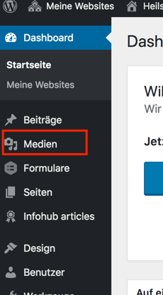
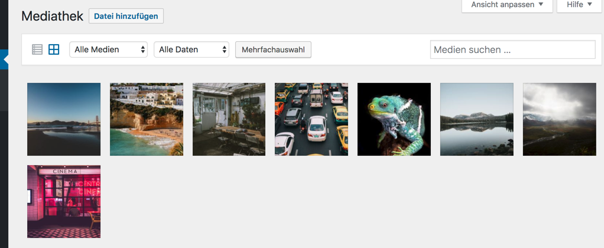
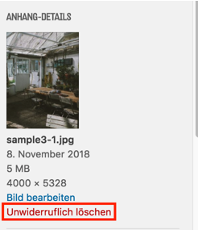

# Die Mediathek
Bevor Sie Bilder oder andere Medien in Ihrer Webseite einsetzen, müssen diese von Ihrem Computer in die WordPress-Mediathek Ihrer Webseite hochgeladen werden. Auf Ihre Mediathek zugreifen können Sie entweder im Backend-Bereich oder im Frontend überall dort, wo Sie die Möglichkeit haben, Medien einzufügen.
Um vom Backend auf die Mediathek zuzugreifen, wählen Sie in der Seitenleiste den Punkt Medien:

Vom Frontend aus wird immer dann auf die Mediathek zugegriffen, wenn Sie die Möglichkeit haben, ein Bild einzufügen. Klicken Sie an einer entsprechenden Stelle den Button:

Sie sind nun in der Mediathek und sehen Ihre Bilder und anderen Medien aufgelistet:

## Neue Medien hochladen
Bevor Sie Medien in Ihrer Webseite verwenden können müssen diese in die Mediathek hochgeladen werden. Am einfachsten ist es, Ihre Medien-Dateien per Drag & Drop in Ihre Mediathek zu ziehen:

## Medien entfernen
Eine einzelne Datei aus der Mediathek löschen können Sie in jedem Mediathek-Fenster, in dem Sie die entsprechende Datei auswählen und den roten Link "Unwiderruflich löschen" anklicken:

