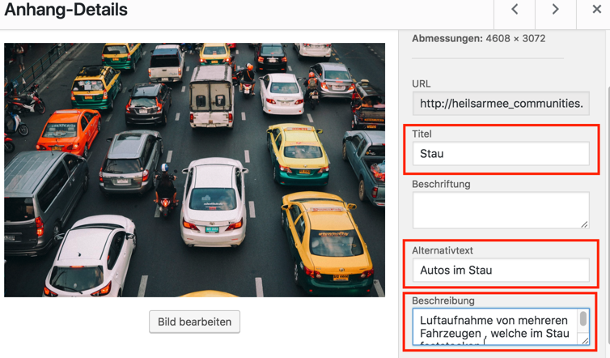

# Metadaten

Aus verschiedenen Gründen ist es wichtig, Ihren Bildern einen Titel und eine Beschreibung zu geben. Suchmaschinen wie Google benutzen diese sogenannten Metadaten, um Ihre Webseite zu finden. Somit helfen Ihnen die Metadaten dabei, von Internetnutzern gefunden zu werden. Auch für die Barrierefreiheit Ihrer Seite sind diese sehr hilfreich. So benutzen z. B. viele Personen mit einer Sehschwäche Programme, welche Webseiten vorlesen können. Stossen diese auf ein Bild in der Webseite, können sie den Beschreibungstext vorlesen und ermöglichen so mehr Menschen Ihre Webseite zu nutzen.

## Metadaten bearbeiten

Um die Metadaten eines Bilds zu bearbeiten, klicken Sie dieses in einem beliebigen Mediathek-Fenster an. Sie sehen nun am rechten Rand oder in einem neuen Fenster einige Informationen und Textfelder zum Bild. Besonders relevant sind hier "Titel", "Alternativtext" und "Beschriftung":

##Relevante Felder

 - "Titel" hilft Ihnen dabei, Ihre Mediathek gut organisiert zu halten und die Medien später wiederzufinden.
 - "Alternativtext" hilft Suchmaschinen das Bild und Ihre Webseite zu durchsuchen und aufzulisten.
 - "Beschreibung" wird von Screen-Reader-Software vorgelesen.

Versuchen Sie also bei möglichst allen verwendeten Bildern diese drei Felder auszufüllen.

