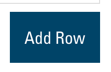
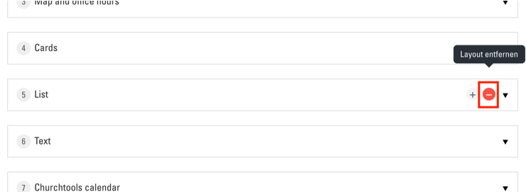
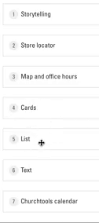
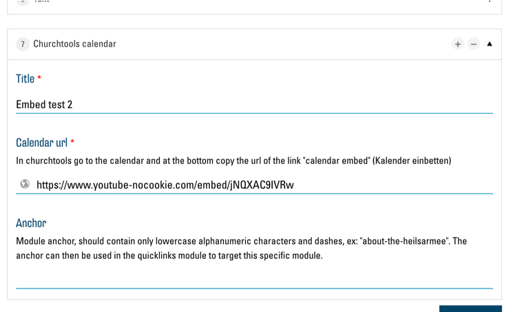

# Arbeit mit Modulen
Jede Webseite ist aus einer beliebigen Auswahl von verschiedenen Modulen in einer bestimmten Reihenfolge aufgebaut. Es stehen Ihnen etwa 12 Module zur Auswahl, um Ihre Webseite aufzubauen. Die Module werden in Ihrer Webseite alle vertikal übereinander dargestellt, wodurch eine long-scrolling Seite entsteht.
Die Liste der Module, welche sich aktuell in Ihrer Seite befinden, finden Sie im "Seite bearbeiten"-Menü. Klicken Sie auf den "Seite bearbeiten"-Button:

Sie sind nun im "Seite bearbeiten"-Menü. Hier sehen Sie unter dem Titel "Modules" die Liste aller Module, die aktuell in der Seite verwendet werden:

## Module hinzufügen
Ein neues Modul zu Ihrer Seite hinzufügen können Sie mit dem Button "Add Row" unter der Liste der Module:

Es öffnet sich eine Liste aller verfügbaren Module:

Klicken Sie nun auf das gewünschte Modul. Es wird der Liste am Ende hinzugefügt. Gleichzeitig öffnet sich das Bearbeitungsmenü des entsprechenden Moduls. (siehe unten)

## Module entfernen
Um ein Modul aus der Liste zu entfernen, klicken Sie auf den "-"-Button beim entsprechenden Eintrag:

Anschliessend auf den roten Link "Remove":

## Module sortieren
Um die Reihenfolge von Modulen zu ändern, können Sie diese in der Liste per Drag&Drop neu anordnen:

## Module bearbeiten
Um die Optionen eines Moduls zu bearbeiten, klicken Sie in der Liste auf das entsprechende Modul. Es öffnet sich das Optionsmenü des Moduls:

Dieses sieht von Modul zu Modul anders aus. Allgemein ist es wichtig, dass Sie bei jedem Feld mit rotem "\*" etwas eingeben müssen (z. B. bei "Title \*" im Beispiel oben). Die genauen Optionen der einzelnen Module werden im entsprechenden Kapitel erklärt.

#### Änderungen speichern

Um Ihre Änderungen zu speichern und zu übernehmen, ist es wichtig, am Schluss ganz unten im Menü auf "Aktualisieren" zu klicken:

Falls die Seite danach nicht neu lädt haben Sie wahrscheinlich eines der obligatorischen Felder vergessen auszufüllen. Nachdem die Seite neu lädt, sind Ihre Änderungen in der Seite sichtbar.
