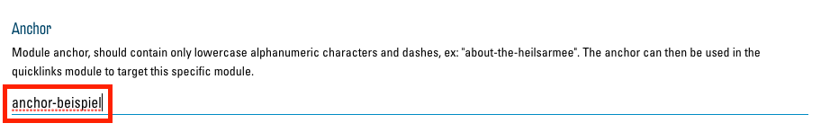
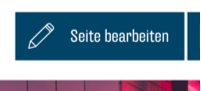
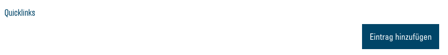
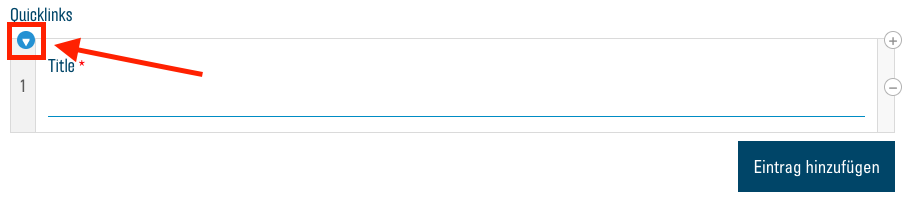
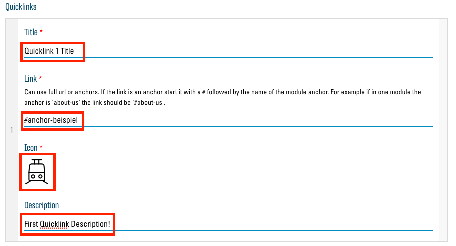
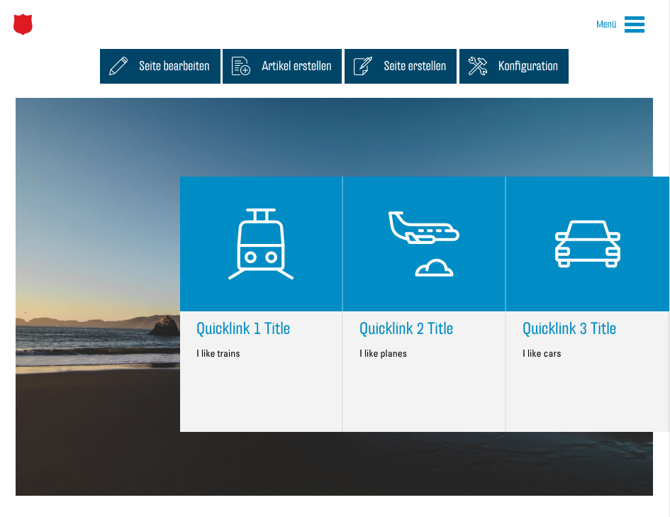

# Anchors und Quicklinks

Die Quicklinks sind ein wichtiger Bestandteil des neuen Konzepts. Sie vereinfachen die Navigation und Orientierung auf einer langen Webseite, indem Sie dem Besucher ermöglichen, direkt zu einem bestimmten Abschnitt auf Ihrer Webseite zu springen, ohne lang zu scrollen.

Die Quicklinks werden auf der Webseite über dem [Header-Bild](00.03-config.md#header) gross angezeigt und verschieben sich an den rechten Rand als kleinere Icons, sobald der Besucher beginnt, nach unten zu scrollen.

## Anchors

Bevor Sie einen neuen Quicklink hinzufügen können, müssen Sie einen "Anchor" erstellen. Ein Anchor ist eine Art Adresse für eine bestimmte Scroll-Position auf Ihrer Webseite. Bei jedem Modul haben Sie die Möglichkeit, einen solchen Anchor einzutragen. Öffnen Sie dazu die Optionen des gewünschten Moduls. Nun tragen Sie im Textfeld unter "Anchor" einen Namen (bzw. Adresse) für Ihren neuen Anchor ein:

Der Name darf auf keinen Fall Leerzeichen enthalten. Es wird empfohlen, den Namen ausschliesslich aus normalen Kleinbuchstaben (keine Umlaute, Accents o. ä.) und Bindestrichen (-) zusammenzusetzen. Zudem sollte er nicht zu kompliziert sein, damit Sie ihn sich einfach merken können. Er sollte sich auf das entsprechende Modul beziehen. So wäre der Name "events" etwa gut für ein Modul geeignet, wo Sie Ihre Events auflisten.

## Permalinks: Verlinken auf Anchors

Als "Permalink" wird ein Link bezeichnet, welcher sich auf eine bestimmte Stelle in einer Webseite verlinkt. Klicken Sie auf einen "normalen" Link, wie z.B [https://de.wikipedia.org/wiki/Heilsarmee](https://de.wikipedia.org/wiki/Heilsarmee), landen Sie ganz oben auf der entsprechenden Webseite. Fügen wir dieser Adresse aber nun einen Verweis auf einen Anchor hinzu, wird diese zu einem Permalink: [https://de.wikipedia.org/wiki/Heilsarmee#Organisation](https://de.wikipedia.org/wiki/Heilsarmee#Organisation). "#Organisation" wurde dem "normalen" Link hinzugefügt. Der Link verweist nun direkt auf den Abschnitt "Organisation", welchem von Wikipedia auch der Anchor-Name "Organisation" zugewiesen wurde. Der Anchor-Name mit einem vorangestellten Hashtag (#) ergibt also einen Permalink zum entsprechenden Anchor.

## Quicklinks

Quicklinks sind Permalinks, welche, wie oben beschrieben, auf Ihrer Webseite dargestellt werden und auf verschiedene Anchors in Ihrer Webseite verweisen. Neue Quicklinks können Sie im "Seite bearbeiten"-Menü hinzufügen. Öffnen Sie dieses mit dem Button "Seite bearbeiten":

Unten im Menü sehen Sie die Liste der aktuell vorhandenen Quicklinks, welche zu Beginn noch leer ist:

Mit dem Button "Eintrag hinzufügen" können Sie dieser Liste einen neuen Quicklink hinzufügen. Zunächst sollten sie mit dem kleinen Pfeil-Button diesen Eintrag öffnen, damit Sie alle Optionen sehen:

Sie können nun den entsprechenden Quicklink konfigurieren:

Tragen Sie bei "Title" einen Namen für Ihren Link ein, welcher dann unter dem Icon angezeigt wird.

Bei "Link" müssen Sie nun den Namen des gewünschten Anchors mit einem Hashtag (#) davor eingeben. Der Link muss abgesehen vom Hashtag exakt dem Namen des Anchors entsprechen.

Unter "Icon" müssen Sie ein Icon wählen, welches Ihren Quicklink repräsentiert. Informationen zur Auswahl von Icons finden Sie hier: [Auswahl von Icons](03.02-icons.md).

Im "Description"-Textfeld können Sie noch eine weitere Beschreibung, welche den Titel ergänzt, eingeben.

Ihr erster Quicklink ist nun gesetzt und Sie können nach dem gleichen Prinzip noch weitere hinzufügen. Das Maximum ist auf fünf Quicklinks festgelegt, damit diese auf jede Bildschirmgrösse passen. Zudem wird empfohlen, die Quicklinks in derselben Reihenfolge zu ordnen, wie die Module, auf die Sie verlinken.

Nachdem Sie über "Aktualisieren" Ihre Änderungen speichern, sollten Sie Ihre neuen Quicklinks auf der Seite haben:

