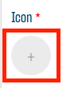
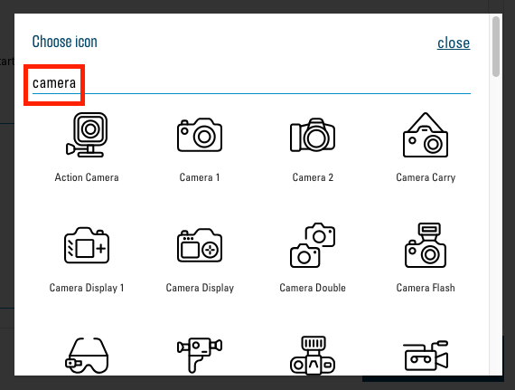

# Auswahl von Icons

Im Modul ["Text and Icon Blocks"](02.01-modules.md#text-and-icon-blocks) und bei den [Quicklinks](03.01-quicklinks.md#quicklinks) können Sie Icons zuweisen. Dazu steht Ihnen eine sehr grosse Bibliothek an hochqualitativen Icons zur Verfügung. Diese Icons haben englische Namen und können anhand dieser durchsucht werden.

Wo immer Sie ein Icon zuweisen können, sehen Sie ein Plus-Icon unter dem Titel "Icon":

Klicken Sie darauf, sehen Sie die Icon-Auswahl:

Hier können Sie nun im Suchfeld einen englischen Begriff eingeben und alle Icons, welche dieses Wort enthalten, werden angezeigt. Klicken Sie nun auf das passendste Icon und schon haben Sie dieses ausgewählt.

## Besser suchen

Um das perfekte Icon zu finden, werden Sie manchmal mehrere Anläufe benötigen. Die meisten Icons haben Nomen als Namen, versuchen Sie also z. B. nach einem Gegenstand zu suchen, welcher mit der gesuchten Bedeutung zusammenhängt.
Kennen Sie den englischen Begriff nicht, nach dem Sie suchen möchten, so benutzen Sie ein Online-Übersetzungstool wie z. B. [dict.cc](https://www.dict.cc/) und probieren Sie verschiedene Synonyme als Suchbegriff.