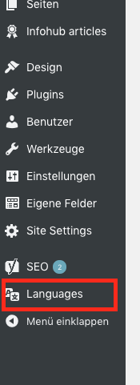
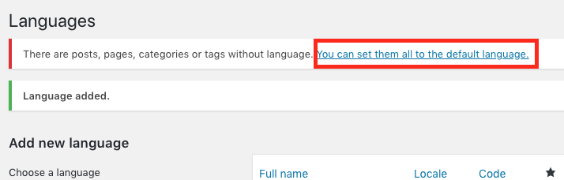
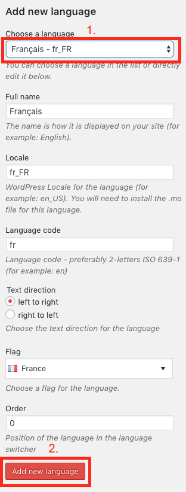

# Mehrsprachigkeit

Für einige Webseiten ist eine Deutsche und eine Französische Übersetzung erwünscht. Dies bedeutet aber einen signifikanten Mehraufwand für Sie, da Sie jede Veränderung für beide Sprachen einzeln machen müssen. Daher sollten Sie Ihre Webseite auch erst übersetzen, wenn Sie ansonsten fertig ist. Sie werden Ihre Seite dann kopieren und in der Kopie alle Texte mit Übersetzungen ersetzen.

Damit Sie Ihre Seite mehrsprachig machen können [müssen Sie auf das Backend zugreifen](00.01-login.md).

Wählen Sie nun in der Seitenleiste den Punkt "Languages".

Fügen Sie nun als erstes die Haupt-/Standardsprache Ihrer Seite hinzu. Dazu wählen Sie in der Liste bei "Choose a language" Ihre Sprache aus (in Ihrem Fall vermutlich "Deutsch - de_CH").

Bestätigen Sie diese Auswahl nun mit dem Button "Add new language".

In der Liste auf der rechten Seite sollte nun Deutsch auftauchen und mit einem Stern markiert sein.

Sie müssen jetzt WordPress mitteilen, dass Ihre bisherige Seite in der eben ausgewählten Sprache ist. Dazu sollte oben eine Meldung auftauchen "There are posts, pages, categories or tags without language. You can set them all to the default language.". Klicken Sie auf diesen Link.

Nach dem gleichen Prinzip fügen Sie nun Ihre zweite Sprache hinzu (in Ihrem Fall vermutlich "Français - fr_FR"):

Die Liste auf der rechten Seite sollte nun beide Sprachen enthalten. Bei Ihrer primären Sprache (die aktuell noch einzige Sprache Ihrer Seite) sollte ein Stern abgebildet sein, bei der neuen Sprache nicht.

Um mit der Übersetzung zu starten [gehen Sie nun zurück in das Frontend](00.02-back-and-front.md#zum-frontend-gelangen). Oben sehen Sie jetzt einen neuen Button "Translate":

Klicken Sie darauf. Die Seite lädt neu und Sie sind nun in der Kopie Ihrer Seite. Oben rechts erscheint eine Sprachauswahl:

Bearbeiten Sie nun alle Module in der neuen Version Seite so, dass alle Texte in der neuen Sprache sind. Von nun an müssen alle Veränderungen an der Seite (z. B. neue Bilder, neue Texte, neue Links) in beiden Versionen der Seite vorgenommen werden. Wechseln Sie also nach jeder Modifikation Ihrer Seite mit der Sprachauswahl in die übersetzte Version und nehmen Sie die selbe Veränderung vor.

