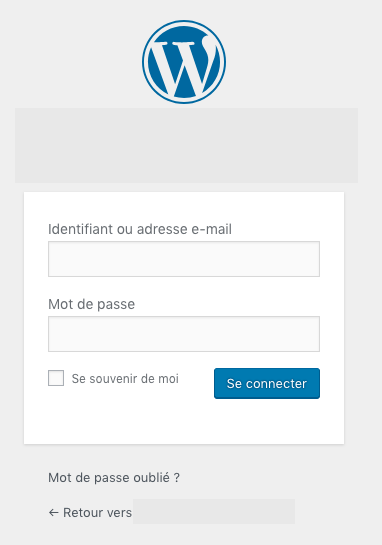
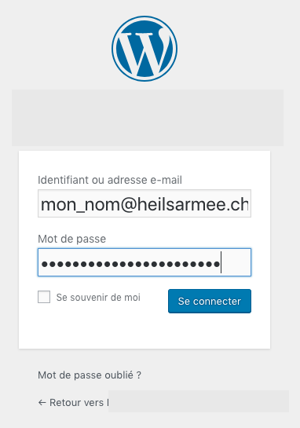

# Connexion
Pour pouvoir modifier votre site, vous devez d'abord vous connecter en tant qu'administrateur de votre site web. Pour ce faire, ajoutez ""/admin" à l'URL de votre page pour accéder à cette page.

    Exemple :
    beispiel.armeedusalut.ch wird zu beispiel.armeedusalut.ch/admin
    http://heilsarmee_communities.staging.stimul.io/exemple/ wird zu http://heilsarmee_communities.staging.stimul.io/exemple/admin

Vous devriez alors accéder au login WordPress :

Le nom d'utilisateur est généralement votre adresse e-mail @armeedusalut.ch avec un tiret bas (_) entre le prénom et le nom.

    Beispiel:
    jane_doe@armeedusalut.ch

Après avoir cliqué sur Connexion, vous accédez à l'interface WordPress, soit le « backend » de votre site web : WordPress Backend
