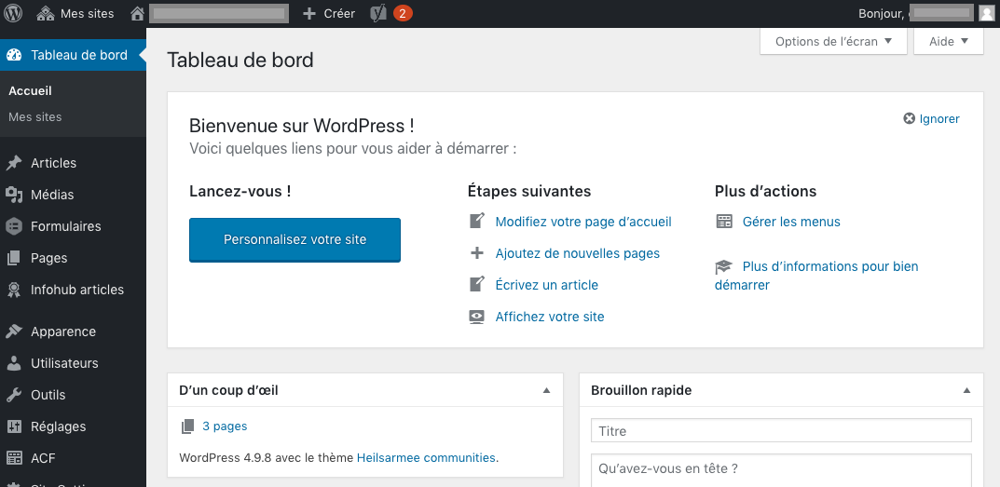
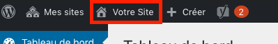
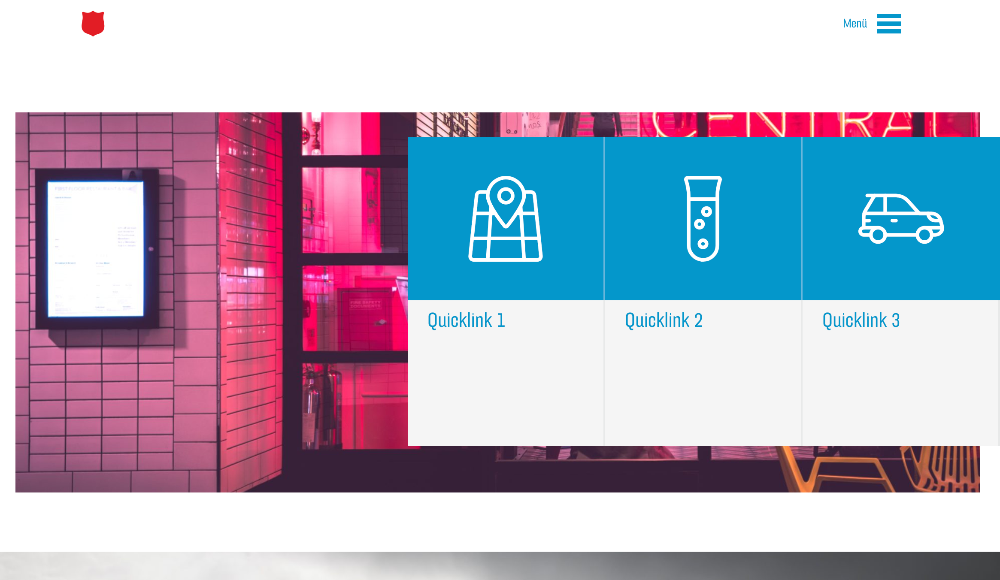
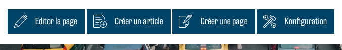

# Backend et frontend

Un backend et un frontend sont à votre disposition pour la gestion et l'édition de votre site web. L'insertion du contenu, la composition des modules et la plus grande partie de votre travail se fera dans le frontend. Dans le backend, vous pouvez par exemple gérer votre médiathèque, modifier les paramètres de langue, gérer les entrées du blog et consulter les statistiques.

# Backend

# Frontend

## Accéder au frontend

Après vous être connecté, vous accéderez toujours en premier au backend de votre site web (l'interface WordPress).

Afin que vous puissiez voir et éditer visuellement votre site web, vous devez accéder au frontend. En haut de l'interface WordPress, vous verrez une liste de vos pages web (généralement une seule page). Pour accéder au frontend, cliquez sur le nom du site web à côté de l'icône de la maison.

Vous devriez maintenant vous trouver dans le frontend avec les droits d'édition de votre site web :

## Edition via le frontend
Si vous êtes connecté en tant qu'administrateur de votre site web et que vous accédez au frontend de votre site web, vous voyez votre site comme un visiteur le ferait. En revanche, contrairement au visiteur normal, vous disposez en tant qu'administrateur de boutons pour modifier le site web :

 - Avec « Éditer la page », vous pouvez ouvrir le menu d'édition de la page en cours et y apporter des modifications ;
 - Avec « Créer un article », vous pouvez poster un nouvel article sur le blog correspondant ;
 - Avec « Créer une page », vous pouvez créer d'autres pages. Cela ne devrait pas être nécessaire pour la plupart des utilisateurs et n'est pas recommandé, car il est conseillé de s'en tenir à un concept « One Page » ;
 - Avec « Configuration », vous pouvez effectuer les réglages généraux pour votre site web. Vous devriez le faire au début et n’y apporter qu’exceptionnellement des modifications par la suite.

De plus, chaque module de votre site web contient un bouton d'édition qui apparaît lorsque vous déplacez le curseur dessus :

Ce bouton permet d’ouvrir le menu d'édition de ce module et vous pouvez modifier le contenu correspondant. 