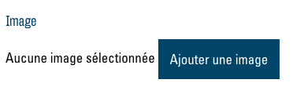
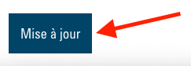

# Konfiguration

Pour commencer, il est recommandé d'effectuer tous les réglages dans le menu de configuration. Cela garantit que tous les modules fonctionnent comme prévu et qu’ils sont personnalisés pour votre site web. Cliquez sur le bouton « Configuration » ([voir Édition via le frontend](00.02-back-and-front.md#bearbeitung-uber-das-frontend)) en haut de votre site web pour ouvrir le menu :

## Fond d'écran du menu

- Sous « Background image », vous pouvez modifier l'image qui apparaît dans le menu de la page. La modification de l’image qui apparaîtra sur votre site web est uniquement requise si vous avez plus d'une page ou si vous créez un site web multilingue. Pour sélectionner une nouvelle image, vous devez d'abord supprimer l'image actuelle. Cliquez sur le bouton « X » qui apparaît lorsque le curseur se trouve sur l'image actuelle :

Vous pouvez maintenant sélectionner une nouvelle image à l'aide du bouton « Ajouter une image » :

 

La fenêtre de la médiathèque s'ouvre et vous pouvez sélectionner l'image souhaitée. Confirmez en cliquant sur « Select » :

 

Vous trouverez d'autres instructions sur l'utilisation de la médiathèque dans la section correspondante.

## Institution

Dans le menu déroulant sous « Institution », sélectionnez le site / l’institution pour lequel est prévu le site web :

Ainsi, par exemple, l'adresse et les heures d'ouverture seront par la suite affichées automatiquement.

## Kontakt E-Mail
- Pour finir, saisissez dans le champ de texte sous « Email » l'adresse e-mail que les visiteurs vont atteindre via le formulaire de contact :

- Pour sauvegarder et appliquer vos modifications, il est important de cliquer à la fin sur « Mettre à jour » au bas du menu :

La configuration de votre site web est alors terminée. Vous pouvez dès lors concevoir et éditer votre site web et son contenu.

# Header
Chaque page web basée sur ce modèle commence par une grande image d'en-tête. Les liens de navigation sont affichés au-dessus. Choisissez donc une image d’en-tête de haute qualité, qui représente votre organisation d'une manière appropriée.
Pour changer votre image d'en-tête, cliquez sur le bouton « Modifier la page » :

Vous êtes maintenant dans le menu « Modifier la page ». Ouvrez alors le menu d'options de la page avec le bouton « Options » :

Pour sélectionner une nouvelle image, vous devez d'abord supprimer l'image actuelle. Cliquez sur le bouton « X » qui apparaît lorsque le curseur se trouve sur l'image actuelle :

Vous pouvez maintenant sélectionner une nouvelle image à l'aide du bouton « Ajouter une image » :

La fenêtre de la médiathèque s'ouvre et vous pouvez sélectionner l'image souhaitée. Confirmez en cliquant sur « Select » :

Vous trouverez d'autres instructions sur l'utilisation de la médiathèque dans la section correspondante. Pour sauvegarder et appliquer vos modifications, il est important de cliquer à la fin sur « Mettre à jour » au bas du menu :

Une fois que votre site web est actualisé à nouveau, vous verrez votre nouvelle image d'en-tête.