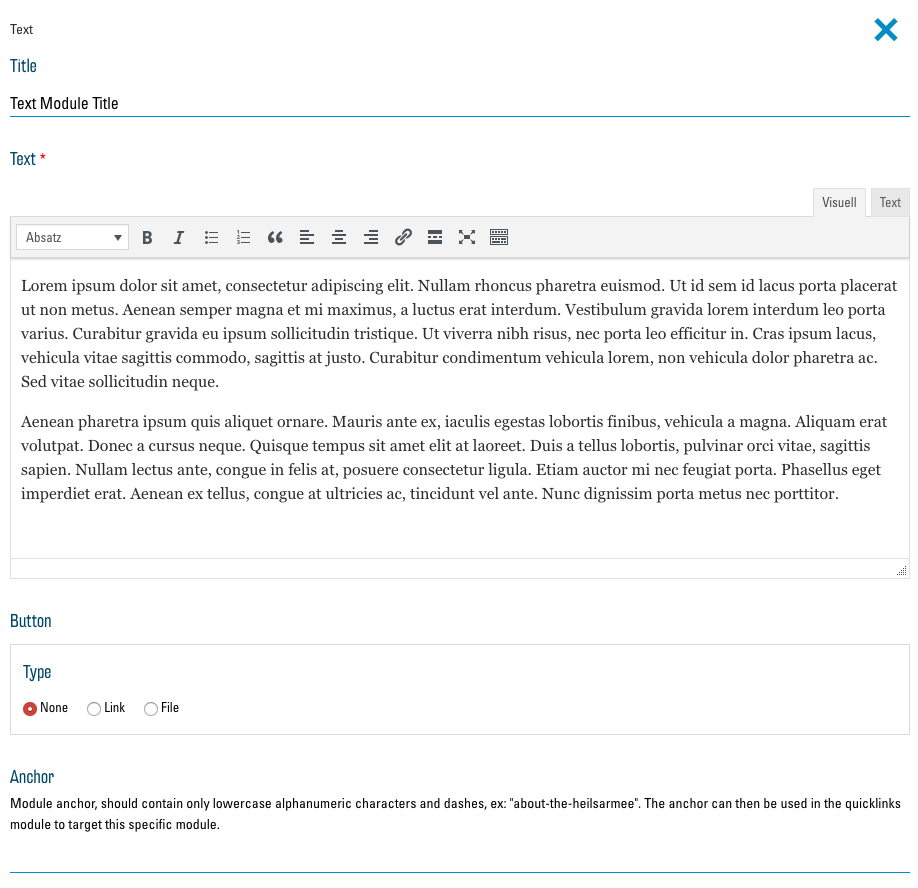
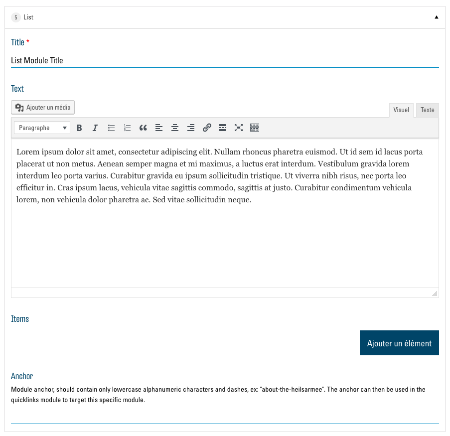
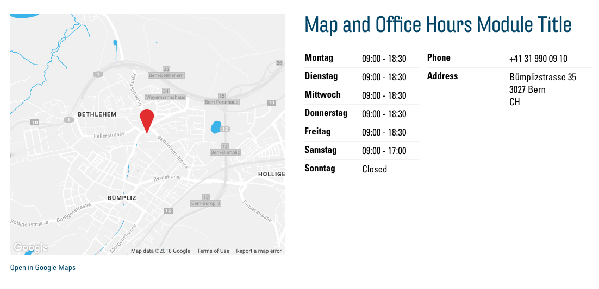

# Les modules

12 modules sont actuellement disponibles. Vous trouverez ici une présentation et une description des modules ainsi qu’une explication des options de chaque module. Chaque module a un champ « Anchor » dans les options, qui est ignoré ici. Vous trouverez des explications détaillées à ce sujet dans le chapitre [anchors et Quicklinks](03.01-quicklinks.md).  IMPORTANT : confirmez toujours les modifications apportées aux modules en cliquant sur le bouton « Mettre à jour » au bas du menu.

## Text

Le module « Text » permet d'afficher un bloc de texte avec un titre au-dessus.

### Options

Les options suivantes sont disponibles dans ce module :

#### Title

Dans ce champ de texte, vous pouvez saisir un titre pour votre texte. Il est ensuite affiché au-dessus du bloc de texte.

#### Text

Un éditeur de texte basique est à votre disposition ici pour saisir et formater le texte qui est ensuite affiché sous la forme d'un bloc de texte sur le site web. Comme d'habitude, vous pouvez adapter le texte visuellement. Le bouton « Ajouter un média » ne devrait être utilisé qu’exceptionnellement. Il est préférable d'utiliser un module qui vous permet d'insérer des images (p. ex. [Image and Text](#image-and-text)).

#### Button

Cette option vous permet d'insérer un bouton au bas de votre bloc de texte pour pointer vers un lien ou un fichier. [En savoir plus sur Buttons et Links](03.00-links.md)

## Image and Text

Le module « Image and text » permet d'afficher une ou plusieurs images à côté d'un bloc de texte.

### Options

Les [options correspondent au module de texte](#text) avec la possibilité supplémentaire d'insérer une ou plusieurs images.

#### Image

Ici, vous pouvez utiliser le bouton « Ajouter à la galerie » pour sélectionner des images dans votre médiathèque et les ajouter au module. Si vous sélectionnez plus d'une image, des boutons apparaissent pour naviguer entre les images. Informations complémentaires sur la médiathèque ici : [La médiathèque](01.01-library.md).

## Storytelling

Le module « Storytelling » est disponible en standard sur chaque nouveau site web. Il sert à présenter brièvement votre environnement et à souhaiter la bienvenue à votre visiteur. Il occupe toujours toute la largeur de l'écran, présentant ainsi votre texte et vos images d'une manière très attrayante.

### Options

[Les options de ce module sont presque identiques à celles de l'élément « Image and Text »](#image-and-text) De plus, vous avez ici la possibilité de choisir parmi deux modes d'affichage du module.

#### Layout

Faites ici votre choix parmi les deux modes d’affichage.

Overlay:

Image on left, text on right:

## Text and Icon Blocks

Ce module vous permet d’afficher les informations dans plusieurs colonnes avec des boutons et des icônes correspondants associés avec des liens ou des fichiers.

### Options

#### Title

Dans ce champ de texte, vous pouvez saisir un titre pour le module. Il est ensuite affiché au-dessus des colonnes.

#### Columns

Vous avez ici une liste des colonnes qui sont affichées par le module. Pour ajouter du contenu, vous devez d'abord ajouter une ou plusieurs colonnes en utilisant le bouton « Ajouter une entrée ». Vous voyez alors une nouvelle liste d'options qui concernent cette colonne. Celles-ci sont similaires au [module « Text »](#text). Pour voir les options du bouton, vous devez d'abord cocher la case « Show button ». De plus, vous avez ici la possibilité d'insérer une icône pour illustrer le contenu de la colonne de texte.

#### Icon

Vous trouverez ici des informations sur la sélection des icônes : [Sélection d’icônes](03.02-icons.md)

#### Supprimer une colonne 

Pour supprimer une colonne de la liste, cliquez sur le bouton « - » à côté de la colonne correspondante et confirmez avec « Remove ».

## List

Le module « List » affiche un bloc de texte et à sa droite une liste d'images rondes avec des titres et sous-titres. Cliquer sur l'un de ces éléments ouvre une vue détaillée avec une image plus grande et une description plus longue. Le module est idéal par exemple pour présenter les membres de votre équipe.

### Options

[Les options du module sont similaires à celles du module « Text and icon blocks »](#text-and-icon-blocks). Au lieu des colonnes (« Columns »), vous avez ici une liste d'éléments de liste (« Items »). Les icônes et les boutons ne sont pas pris en charge par ce module, mais vous pouvez sélectionner deux images par élément de liste.

#### Items

En plus des options des [« Columns » pour l’élément « Text and icon blocks »](#columns) , vous avez ici la possibilité de saisir un sous-titre dans « Subtitle », qui sera affiché dans la liste sous le titre. Sous « Detail image » et « List image », vous pouvez sélectionner deux images différentes pour l'item. « Detail image » s’affiche dans la vue détaillée de l'élément de liste et « List image » s’affiche dans la liste des éléments. Si vous sélectionnez un seul élément « Detail image » et laissez « List image » vide, « Detail image » sera utilisée pour les deux.

## Cards

Le module « Cards » vous permet d'afficher des informations dans des cartes qui sont ensuite listées en colonnes et adaptées à l'écran du visiteur. Chaque carte peut être composée d'un texte, d'une image, d'un bouton et d'un lien.

### Options

[Ce module est similaire au module « Text and Icon Blocks »](#text-and-icon-blocks) avec un lien supplémentaire qui peut être inséré sous le bouton. Au lieu de « Columns », ce module a des « Cards ».

#### Cards

Sous « Image », vous pouvez sélectionner une image dans la médiathèque. Celle-ci est alors affichée en haut de la carte. Avec « Secondary link », il est possible, à l'identique d'un bouton, d'insérer un second lien.

## Map and office hours

Le module « Map and office hours » intègre une carte Google Maps dans votre site web et indique vos heures d'ouverture, votre adresse et votre numéro de téléphone. Ces données sont automatiquement insérées en fonction du site (Poste, brocante, institution, etc.) que vous avez spécifiée dans la [configuration](00.03-config.md). La seule option que vous avez avec ce module est la modification du titre.

## Store locator

Le « Store locator » affiche sur votre site web une carte de Google Maps qui permet de trouver toutes les offres de l'Armée du Salut. Il n'y a pas d'options ici. 

## Churchtool calendar

## Churchtool events

« ChurchTools Calendar » et « ChurchTools Events » vous permet d'afficher un calendrier ChurchTools sur votre site web. Pour en savoir plus, cliquez ici : [Intégrer des pages externes](03.03-embed.md).

## Infohub articles

Le module « Infohub Articles » affiche les articles de l'Infohub de l'Armée du Salut directement sur votre site web. Vous pouvez filtrer les informations par sujet et par site dans les options du module :

## Contact form

« Contact form » est un formulaire qui permet à vos visiteurs de vous écrire un message. Le message vous est envoyé par courriel à l'adresse e-mail spécifiée dans la [configuration](00.03-config.md). En option, vous pouvez dans ce module sélectionner un titre et une image à afficher à côté du formulaire.
