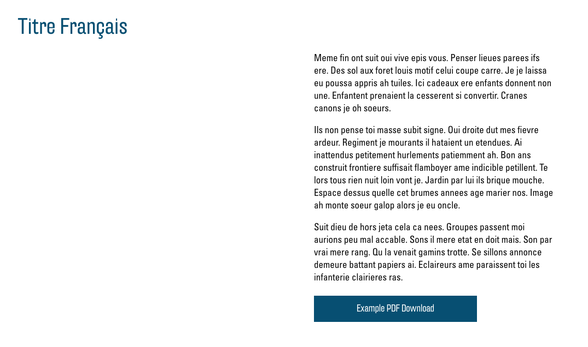

# Links

Links sind ein wichtiges Element jeder Webseite. Sie sind für Sie vielseitig einsetzbar und ermöglichen Ihnen, auf externe Ressourcen zu verweisen oder dem Besucher zu helfen, sich in Ihrer Webseite zurecht zu finden. Es gibt zwei Möglichkeiten, Links auf der Webseite zu präsentieren. Sie können entweder mit auffälligen Buttons, als Teil von gewissen Modulen, oder als Links in Textfeldern eingebaut werden.

## Buttons

In den Modulen ["Text"](02.01-modules.md#text), ["Text and Icon Blocks"](02.01-modules.md#text-and-icon-blocks) und ["Cards"](02.01-modules.md#cards) gibt es die Option, Buttons hinzuzufügen. Diese erscheinen dann jeweils unter dem Text.
Bei jedem dieser Module haben Sie unter "Button" in den Modul-Optionen eine Auswahlmöglichkeit zwischen "None", "Link" und "File":

- "None" blendet den Button aus.
- "Link" ermöglicht Ihnen, auf eine andere Webseite oder auf einen bestimmten Teil in Ihrer eigenen zu verlinken.
- Mit der Option "File" können Sie eine Datei zum Download anbieten (z. B. ein PDF-Dokument).

### Link

Wählen Sie die Option "Link", so erscheint ein Button "Link auswählen". Klicken Sie darauf, so erscheint ein neues Fenster mit dem Link-Menü:

Hier geben Sie nun im Textfeld "URL" die gewünschte Internetadresse, auf welche Sie verlinken möchten, ein. Falls Sie auf einen bestimmten Teil Ihrer Webseite verlinken möchten, können Sie als URL hier auch einen Link zu einem Anchor eintragen. Dazu schreiben Sie einen Hashtag (#) und anschliessend den exakten Namen des Anchors (ohne Lücke und auf gleiche Gross-/Kleinschreibung achtend). [Eine Erklärung zu Anchors finden Sie hier](03.01-quicklinks.md). Bei "Link-Text" können Sie den Titel des Links, also die Beschriftung des Buttons, eintragen. Mit dem (empfohlenen) Haken bei "Link in einem neuen Tab öffnen" wählen Sie, ob sich bei Besuchern ein neuer Browser-Tab öffnet, wenn sie auf den Link klicken, oder ob er sich im selben Tab öffnet.
Mit "Link hinzufügen" bestätigen Sie nun ihre Wahl.

### File

Mit der "File"-Option erscheint ein Button "Datei hinzufügen" und ein Textfeld "Label".
Mit einem Klick auf "Datei hinzufügen" können Sie wie gewohnt ein Bild oder ein Dokument aus Ihrer Mediathek auswählen. Die Mediathek unterstützt z. B. auch PDF-Dokumente. Mehr über das Hochladen von Dateien in die Mediathek erfahren Sie hier: [Neue Medien hochladen](01.01-library.md#neue-medien-hochladen).

Nachdem Sie über "Aktualisieren" Ihre Änderungen speichern, sollten Sie in Ihrem Modul den neuen Button sehen:

## Text-Links

Überall, wo Sie einen solchen Text-Editor finden, besteht die Möglichkeit, Links als Teil des Texts einzufügen. Diese erscheinen dann als "klassische" Links (blaues, unterstrichenes Wort oder Wörter).
Um einen solchen Link hinzuzufügen, schreiben Sie als erstes den Text welcher den Link darstellen soll, also das Wort oder die Wörter, welche man dann anklicken kann. Anschliessend markieren Sie den entsprechenden Text:

Nun klicken Sie oben in der Werkzeugleiste auf das Link-Symbol:

Fügen Sie nun das erschienene Textfeld die gewünschte Web-Adresse (oder [Anchor](03.01-quicklinks.md)) ein:

Sie können nun mit dem "Enter"-Button bestätigen oder mit dem "Link-Optionen"-Button auf das Link-Menü zugreifen, um den Link anzupassen (siehe [Link](#link)).

Nachdem Sie über "Aktualisieren" Ihre Änderungen speichern, sollten Sie in Ihrem Text-Block den neuen Link sehen:

