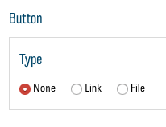
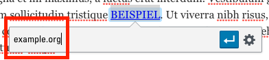

# Les liens

Les liens sont un élément important de tout site web. Ils peuvent être utilisés de façon polyvalente et vous permettent de vous référer à des ressources externes ou d'aider le visiteur à trouver son chemin sur votre site web. Il y a deux possibilités de présenter des liens sur le site web : ils peuvent être intégrés soit avec des boutons accrocheurs dans certains modules, soit sous forme de liens dans des champs de texte.

## Buttons

Dans les modules ["Text"](02.01-modules.md#text), ["Text and Icon Blocks"](02.01-modules.md#text-and-icon-blocks) et ["Cards"](02.01-modules.md#cards) , il est possible d'ajouter des boutons qui vont s’afficher sous le texte. Pour chacun de ces modules, vous avez le choix entre « None », « Link » et « File » sous « Button » dans les options des modules :

- « None » cache le bouton.
- « Link » vous permet de créer un lien vers un autre site web ou vers une partie spécifique de votre propre site web.
- Avec l'option « File », vous pouvez proposer un fichier à télécharger (par ex. un document PDF).

### Link

Si vous sélectionnez l'option « Link », un bouton "Sélectionner lien". En cliquant dessus, une nouvelle fenêtre apparaît avec le menu de liens :

Dans le champ de texte « URL », saisissez l'adresse Internet vers laquelle vous souhaitez créer un lien. Si vous souhaitez créer un lien vers une certaine partie de votre site web, vous pouvez également saisir ici comme URL un lien vers un « anchor ». Pour ce faire, écrivez un hashtag (#) puis le nom exact de l'anchor (sans espace et tout en minuscules). [Vous trouverez une explication sur les anchors ici.](03.01-quicklinks.md). Sous « Link-Text », vous pouvez entrer le titre du lien, c'est-à-dire l'intitulé du bouton. En cochant la case « Ouvrir le lien dans un nouvel onglet », vous choisissez si le lien s’ouvre dans un nouvel onglet du navigateur pour les visiteurs lorsqu'ils cliquent sur le lien, ou s'il s'ouvre dans le même onglet.
Cliquez sur « Ajouter un lien » pour confirmer votre choix.

### File

Avec l'option « File », un bouton « Ajouter fichier » et un champ de texte « Label » apparaissent. En cliquant sur « Ajouter fichier », vous pouvez comme d’habitude sélectionner une image ou un document dans votre médiathèque. La médiathèque prend également en charge les documents PDF. Plus d'informations sur le téléchargement de fichiers dans la médiathèque ici : [Télécharger de nouveaux fichiers média ](01.01-library.md#telecharger-de-nouveaux-fichiers-media).

Après avoir sauvegardé vos modifications via « Mettre à jour », vous devriez voir le nouveau bouton dans votre module :

## Text-Links

Partout où vous trouvez un tel éditeur de texte, vous avez la possibilité d’insérer des liens en tant que partie du texte. Ceux-ci apparaissent alors comme des liens « classiques » (un ou plusieurs mots bleus soulignés). Pour ajouter un tel lien, écrivez d'abord le texte qui doit représenter le lien, c'est-à-dire le ou les mots qui peuvent être cliqués. Marquez ensuite le texte correspondant :

Cliquez maintenant sur le symbole du lien en haut dans la barre d'outils :

Ajoutez l'adresse web (ou [anchor](03.01-quicklinks.md)) dans le champ de texte qui apparaît :

Vous pouvez maintenant confirmer avec le bouton « Enter » ou accéder avec le bouton « Link Options » au menu des liens pour ajuster le lien (voir [Link](#link)).

Après avoir sauvegardé vos modifications via « Mettre à jour », vous devriez voir le nouveau lien dans votre bloc de texte :

