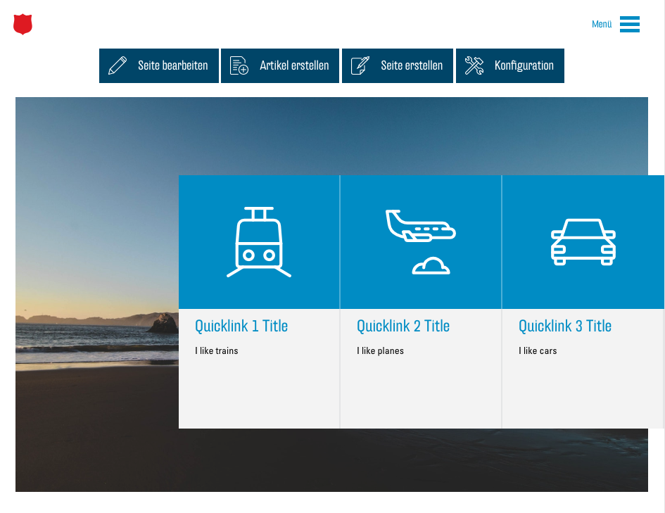

# Anchors et quicklinks

Les quicklinks sont un élément important du nouveau concept. Ils simplifient la navigation et l'orientation dans un long site web en permettant au visiteur de sauter directement à une section spécifique du site web sans devoir faire défiler la page longtemps.

Les quicklinks sont affichés en gros au-dessus de [l'image d'en-tête](00.03-config.md#header) du site web et se déplacent vers la droite sous forme de petites icônes lorsque le visiteur commence à faire défiler la page vers le bas.

## Anchors

Avant de pouvoir ajouter un nouveau quicklink, vous devez créer un « anchor ». Il s’agit d’une sorte d'adresse pour une position de défilement spécifique sur votre site web. Vous avez la possibilité d'insérer un anchor pour chaque module. Ouvrez pour ce faire les options du module souhaité. Entrez maintenant un nom (ou une adresse) pour votre nouvel anchor dans le champ de texte sous « Anchor » :

Le nom ne doit contenir aucun espace. Il est recommandé qu’il soit composé exclusivement de lettres minuscules normales (pas de trémas, accents, etc.) et de tirets (-). De plus, il ne doit pas être trop compliqué pour que vous puissiez facilement vous en souvenir et il doit se référer au module correspondant. Par exemple, le nom « events » serait approprié pour un module dans lequel vous listez vos événements.

## Permalinks : créer un lien vers les anchors

Un « permalink » est un lien qui renvoie à un endroit précis d'un site web. Si vous cliquez sur un lien « normal », par ex. [https://fr.wikipedia.org/wiki/Armée_du_Salut](https://fr.wikipedia.org/wiki/Armée_du_Salut), vous vous retrouverez en haut du site correspondant. Si nous ajoutons maintenant une référence à un anchor à cette adresse, elle devient alors un permalink :  [https://fr.wikipedia.org/wiki/Armée_du_salut#Structure](https://fr.wikipedia.org/wiki/Armée_du_salut#Structure). « #Structure » a été ajouté au lien « normal ». Le lien renvoie maintenant directement à la section « Structure », à laquelle Wikipedia a également attribué le nom d’anchor « Structure ». Le nom de l’anchor précédé d'un hashtag (#) crée un permalink vers l’anchor correspondant.

## Quicklinks

Les quicklinks sont des permalinks qui, comme décrit ci-dessus, sont affichés sur votre site web et renvoient à différents anchors sur votre site web. Vous pouvez ajouter de nouveaux quicklinks dans le menu « Modifier la page » Ouvrez-le avec le bouton « Modifier la page » :

Au bas du menu, vous pouvez voir la liste des quicklinks actuellement disponibles. Au début, cette liste est vide :

Avec le bouton « Ajouter une entrée », vous pouvez ajouter un nouveau quicklink à cette liste. Ouvrez d'abord cette entrée à l'aide de la petite flèche, de façon à voir toutes les options :

Vous pouvez maintenant configurer le quicklink correspondant :

Entrez un nom pour votre lien dans le champ « Title » qui s’affiche sous l'icône.

Sous « Link », vous devez maintenant entrer le nom de l’anchor désiré précédée d’un hashtag (#). Le lien doit correspondre exactement au nom de l’anchor, mais sans le hashtag.

Sous « Icon », vous devez choisir une icône qui représente votre quicklink. Vous trouverez ici des informations sur la sélection des icônes : [Sélection d’icons](03.02-icons.md).

Dans le champ de texte « Description », vous pouvez entrer une autre description qui complète le titre.

Votre premier quicklink est maintenant créé et vous pouvez en ajouter d'autres selon le même principe. Le maximum est fixé à 5 quicklinks pour s'adapter à n'importe quelle taille d'écran. Il est également recommandé de présenter les quicklinks dans le même ordre que les modules auxquels ils renvoient.

Après avoir sauvegardé vos modifications via « Mettre à jour », vos nouveaux quicklinks devraient s'afficher sur la page

