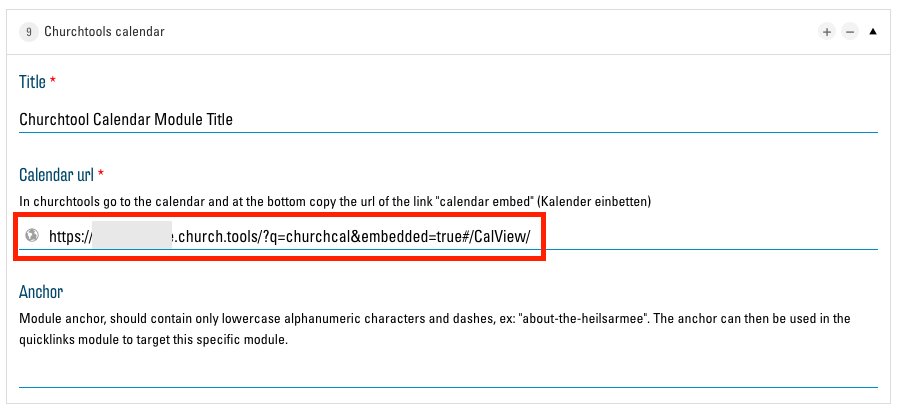
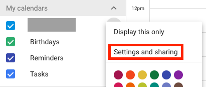

# Intégrer des pages externes

Les fonctionnalités de votre site web peuvent être étendues presque à l'infini si vous intégrez des sites web et des outils externes. Cependant, dans la plupart des cas, il est recommandé de [créer des liens vers des pages externes](03.00-links.md) au lieu de les intégrer. Contrairement à l'intégration, les liens améliorent la cohérence, la clarté et la vitesse de chargement du site web.

L'intégration vous permet par ex. d'afficher des vidéos YouTube directement en tant que player, d'afficher des calendriers Google ou des agendas ChurchTools sur votre site web, d'afficher vos propres sites dans Google Maps, d'intégrer des boutons « J’aime » de Facebook et bien plus encore.

## iFrames

La fonction qui permet d'intégrer n'importe quelle page web s'appelle « iFrame ». iFrame crée une sorte de fenêtre à travers laquelle vous pouvez voir une autre page sur votre site web. Voici un exemple avec Google Calendar, YouTube et Wikipedia :

## ChurchTools-Calendar-Modul

Avec le module ["ChurchTools Calendar"](02.01-modules.md#churchtools-calendar) , vous avez la possibilité, en tant qu'utilisateur de ChurchTools, d'afficher une vue du calendrier directement sur votre site web. En option pour ce module, vous disposez d'un champ de texte dans lequel vous devez saisir le lien correspondant pour le calendrier de ChurchTools : 

Vous trouverez ce lien sur la page calendrier de votre ChurchTool. Cliquez sur le bouton « Intégrer le calendrier » qui se trouve en bas à droite dans le calendrier :

Un nouvel onglet s'ouvre avec une vue du calendrier sans autres éléments d'interface. Copiez le lien de cette page :

Vous pouvez maintenant entrer le lien copié dans le module ChurchTools Calendar comme indiqué ci-dessus.

## Autre utilisation du ChurchTools Calendar

Il est possible d'utiliser le module « ChurchTools Calendar » pour d'autres outils et sites web que ChurchTools. En principe, n'importe quelle adresse peut être spécifiée comme « Calendar Url » :

Le site web correspondant sera alors intégré dans votre site web en tant que module. Mais n'oubliez pas que l'ensemble du site est toujours affiché et que vous devez souvent trouver des liens spécifiques qui n'affichent que le contenu désiré. En outre, de nombreux sites web ne peuvent pas être intégrés, ce qui se traduit par un message d'erreur de ce type :

Cependant, de nombreux sites web, comme ChurchTools, offrent des liens spécifiques qui sont bien adaptés. Voici quelques indications pour les trouver.

### YouTube

Pour trouver le lien intégrable pour les vidéos YouTube, cliquez sur le bouton « Share » qui se trouve sous la vidéo sur la page YouTube :

Une nouvelle fenêtre s'ouvre pour que vous puissiez intégrer le lien souhaité via le bouton « Embed » :

Ici, vous trouvez après « src= » le bon lien pour le module « ChurchTools Calendar » :

Pour l'intégration manuelle avec iFrame dans un champ de texte, sélectionnez tout le bloc de texte affiché.

### Calendrier Google

Pour trouver le lien intégrable du calendrier Google, cliquez sur le bouton « Settings and sharing » dans le menu des options du calendrier souhait :

Assurez-vous que votre calendrier est public afin que chaque visiteur de votre site web puisse le voir :

le lien pour le module ChurchTools se trouve dès lors tout en bas de la page des paramètres :

## Insertion manuelle d’iFrames (pour les utilisateurs confirmés)

Dans chaque champ de texte d'un module, vous trouverez un éditeur de texte dans les options. En haut de l'éditeur de texte, vous avez le choix entre « Visuel » et « Texte ». Sélectionnez le mode « Texte ».

Vous voyez maintenant le code HTML du champ de texte.

Vous pouvez maintenant insérer une partie de code HTML à l'endroit désiré. Vous trouverez souvent le bon morceau de code, tout comme les liens du module ChurchTools Calendar, sur le site web correspondant. Vous pouvez également en créer un vous-même comme suit :
<iframe src=“ICI L'URL DÉSIRÉE”>