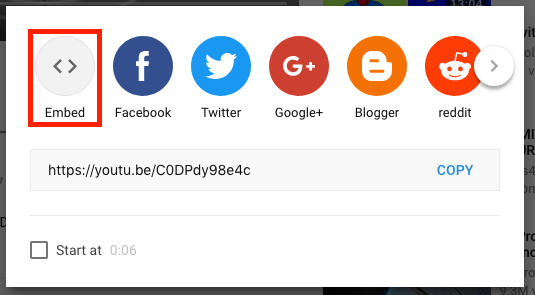
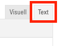

# Externe Seiten einbetten

Der Funktionsumfang Ihrer Webseite kann beinahe grenzenlos erweitert werden, wenn Sie externe Webseiten und Tools einbetten. In den meisten Fällen wird jedoch empfohlen, [auf externe Seiten zu verlinken](03.00-links.md), anstatt Sie einzubetten. Das Verlinken führt im Gegensatz zum Einbetten zu einem konsistenteren Design und einer übersichtlicheren und schneller ladenden Webseite.

Das Einbetten ermöglicht Ihnen z. B., YouTube-Videos direkt als Player darzustellen, Google-Kalender oder ChurchTools-Agenden auf Ihrer Webseite abzubilden, eigene Google-Maps-Standorte darzustellen, Facebook-Like-Buttons einzubetten und vieles mehr.

## iFrames

Die Funktion, welche es möglich macht, beliebige Webseiten einzubetten, nennt sich "iFrame". Ein iFrame richtet eine Art Fenster ein, durch welches Sie eine andere Seite auf Ihrer Webseite einsehen. Hier ein Beispiel mit Google Kalender, YouTube und Wikipedia:


## ChurchTools-Calendar-Modul

Mit dem Modul ["ChurchTools Calendar"](02.01-modules.md#churchtools-calendar) haben Sie, als Benutzer von ChurchTools, die Möglichkeit, eine Kalender-Ansicht direkt auf Ihrer Webseite anzuzeigen. Als Option bei diesem Modul haben Sie ein Textfeld, in welches Sie den entsprechenden Link für den Kalender aus ChurchTools eintragen müssen: 


Diesen Link finden Sie auf der Kalender-Seite Ihres ChurchTools. Klicken Sie dazu in der Kalender-Ansicht unten rechts auf "Kalender einbetten":


Es öffnet sich ein neuer Tab mit einer Ansicht des Kalenders, ohne andere Interface-Elemente. Kopieren Sie nun den Link dieser Seite:


Den kopierten Link können Sie nun wie oben gezeigt im ChurchTools Calendar Modul eintragen.

## ChurchTools Calendar anders einsetzen

Es besteht die Möglichkeit, das "ChurchTools Calendar"-Modul für andere Tools und Webseiten einzusetzen als nur ChurchTools. Im Prinzip kann als "Calendar url" eine beliebige Adresse angegeben werden:


Die zugehörige Webseite wird anschliessend als Modul in Ihre Webseite eingebettet. Vergessen Sie aber nicht, dass immer die gesamte Webseite angezeigt wird und Sie häufig spezielle Links finden müssen, welche nur den gewünschten Inhalt darstellen. Zudem lassen viele Webseiten es nicht zu, eingebettet zu werden, was sich dann in einer solchen Fehlermeldung äussert:


Viele Webseiten bieten jedoch, wie auch ChurchTools, besondere Links an, welche sich zum Einbetten gut eignen. Hier einige Hinweise, wie Sie diese finden können.

### YouTube

Um den einbettbaren Link für YouTube-Videos zu finden, klicken Sie auf der YouTube-Seite unter dem Video auf den "Teilen"-Button:


Es öffnet sich ein neues Fenster, wo Sie über den "Einbetten"-Button zum benötigten Link gelangen:



Hier finden Sie nach "src=" den richtigen Link für das "ChurchTools Calendar"-Modul:


Für das manuelle Einbetten mit iFrame in einem Textfeld nehmen Sie den gesamten angezeigten Textblock.

### Google Kalender

Um den einbettbaren Link für Google-Kalender zu finden, klicken Sie im Optionsmenü des gewünschten Kalenders auf den Einstellungen-Button:


Stellen Sie sicher, dass Ihr Kalender öffentlich ist, damit ihn jeder Besucher Ihrer Webseite sehen kann:


Sie finden den Link für das ChurchTools-Modul nun ganz unten auf der Einstellungsseite:


## iFrames manuell einfügen (für Fortgeschrittene)

In jedem Modul mit Textfeld finden Sie bei den Optionen einen Text-Editor dafür. Oben im Text-Editor sehen Sie eine Auswahl zwischen "Visuell" und "Text". Wechseln Sie zur Text-Ansicht.



Sie sehen nun den HTML-Code des Textfelds.


Hier können Sie nun an der gewünschten Stelle ein HTML-Code-Teil einfügen. Das richtige Stück Code finden Sie, ähnlich wie die Links für das "ChurchTools-Calendar"-Modul, oft auf der entsprechenden Webseite. Sie können ein solches folgendermassen auch selbst erstellen:
```  <iframe src="HIER DIE GEWÜNSCHTE URL"></iframe> ```.