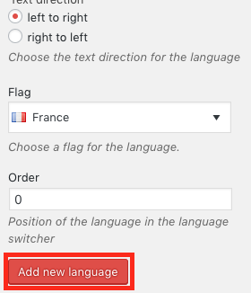

# Multilinguisme

Pour certains sites, une traduction en allemand et en français est nécessaire. Mais cela représente un effort supplémentaire pour vous, car vous devez faire chaque changement séparément pour les deux langues. Par conséquent, vous ne devriez pas traduire votre site Web avant qu'il ne soit terminé. Vous copierez ensuite votre page et remplacerez tous les textes de la copie par des traductions.

Pour rendre votre site multilingue [vous devez accéder au backend](00.01-login.md).

Sélectionnez maintenant "Langues" dans la barre latérale.

Tout d'abord, ajoutez la langue principale/standard à votre page. Pour ce faire, sélectionnez votre langue dans la liste sous "Choose a language" (dans votre cas probablement "Français - fr_FR").

Confirmez cette sélection avec le bouton "Ajouter une nouvelle langue".

Dans la liste à droite, vous devriez voir le français, marqué d'un étoile.

Vous devez maintenant indiquer à WordPress que votre page précédente est dans la langue que vous venez de sélectionner. Un message "There are posts, pages, categories or tags without language. You can set them all to the default language.". Cliquez sur ce lien.

Ajoutez maintenant votre deuxième langue selon le même principe (dans votre cas probablement "Deutsch - de_CH") :

La liste de droite devrait maintenant contenir les deux langues. Votre langue principale (actuellement la seule langue sur votre site) devrait avoir une étoile, la nouvelle langue ne devrait pas en avoir.

Pour lancer la traduction[retourner au front-end](00.02-back-and-front.md#acceder-au-frontend). En haut, vous verrez un nouveau bouton "Traduire" : 

Cliquez dessus. La page se recharge et vous êtes maintenant dans la copie de votre page. Une sélection de langue apparaît en haut à droite :

Editez maintenant tous les modules de la page de la nouvelle version pour que tous les textes soient dans la nouvelle langue. Tous les changements effectués sur la page (par ex. nouvelles images, nouveaux textes, nouveaux liens) doivent maintenant être effectués dans les deux versions de la page. Après chaque modification de votre page, passez à la version traduite avec la sélection de la langue et faites les mêmes modifications.

